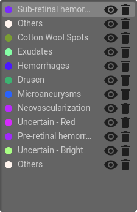
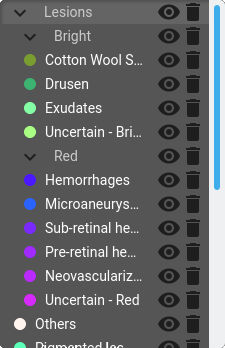

Editor
=======

The editor is the main tab of the platform, where the annotation work is done. This page will guide through all its functionalities.

Visualization tools
--------------------

The list of biomarker is shown in the top right quadrant of the interface. 

   
   

It is possible to switch from the list view to the hierarchical view by pressing the |hierarchical_mode| button.

+----------------------+---------------------------+
| |imageListBiomarker| | |imageHierarchyBiomarker| |
|                      |                           |
| List of biomarkers   | Hierarchy of biomarkers   |
+----------------------+---------------------------+

The biomarker that appears in light gray is the active one (the one that is currently editable). It will also appear in the information panel in the top center quadrant of the interface.

Each biomarker can be individually hidden by clicking on the corresponding |visibility| button. 

.. warning:: Drawing functions are disabled in a hidden biomarker, the visibility has to be set.

.. note:: In the current state of the platform, displaying all the biomarkers can significantly degrade the performances. To benefit from a smoother experience, we recommend to only display the one that is currently edited.

Drawing tools
--------------
The bar on the left is composed of the different tools.

#. The **pan** |panTool| tool is used to move the view in the image. The same effect can be obtained by pressing the middle mouse button |centerMouseClick|.

#. The **brush** |brushTool| tool is the main tool to draw in a selected biomarker color. Once selected, a property panel appears in the top left of the interface

    .. image:: ../images/propertiesPanel.png
    
    #. Size: Let's you adjust the size of the brush
    #. Keep Shape: This option is used to convert existing biomarkers into the current selected biomarker. In other words, with this option, the brush does not draw any new pixels, but will only convert the ones covered by the brush.
    

#. The **fill brush** |fillTool| tool works in a similar way as the brush. Instead of drawing pixels under the brush, the user can circle area in the image. The area will be automatically filled. 

#. The **eraser** |eraserTool| is the opposite of the brush. By default, it can be used to erase pixels of the given biomarker under the brush. If *Eras all* option is ticked, then all biomarkers under the brush will be erased.

#. The **lasso eraser** |lassoEraserTool| has the same effect behavior as the fill brush but for an eraser. It's the most convenient way to erase large area of the image.

#. The **pick biomarker** |pickTool| lets you change the active biomarkers to the type of the one selected on screen with the pick. The same effect can be obtained with pressing the right mouse button |mouseRight|.
