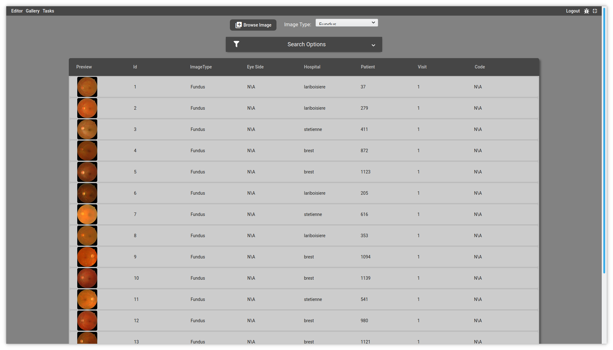

Gallery
=======

The gallery lets you browse the across all the images stored in the database.

   
Images can be filtered using the search options

.. note::
   The |browse| button lets you manipulate your own local file in the editor. By default, it will assume it is a *fundus* image. The image will be loaded in the editor, but no pre-annotation will be available. Nonetheless, you will be able to save your annotations locally (they will be downloadable as a **.svg** file).

.. warning::
    In the future, the **Image Type** combobox will allows switching between the *Fundus* and the *OCT* database. To this day, this feature is not implemented, as only fundus images are considered in the project.
    
