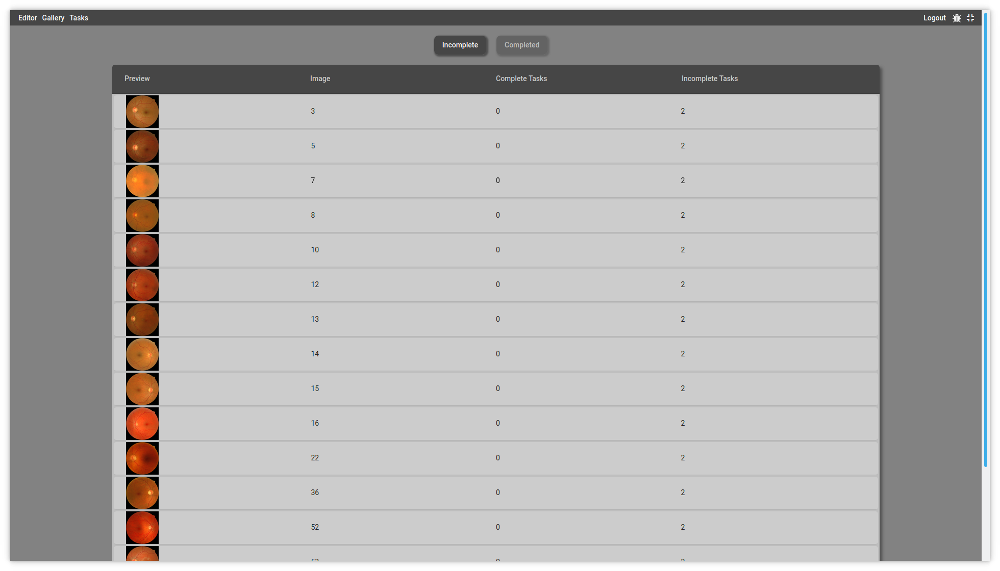
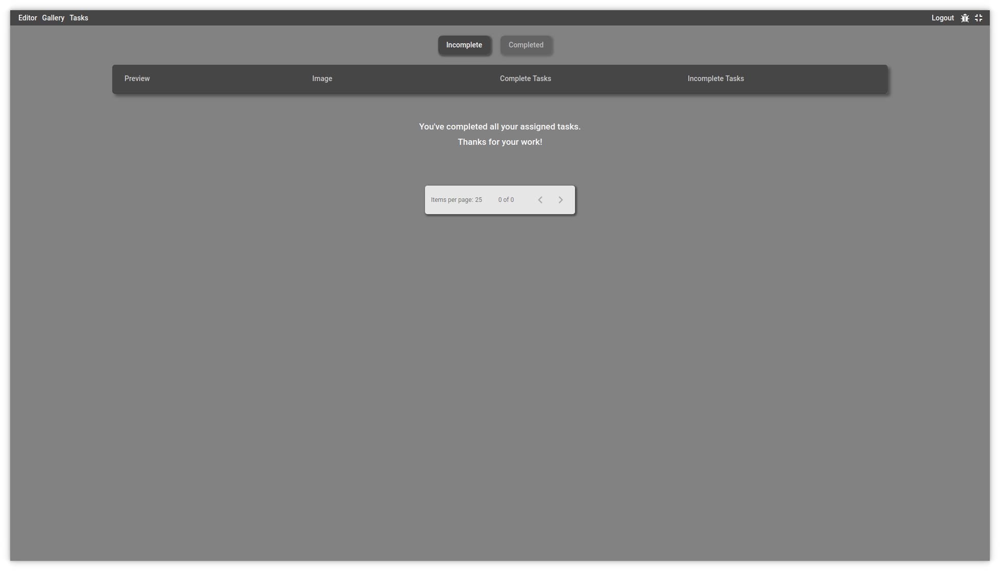
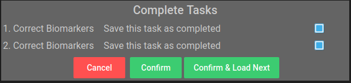

Tasks
=====

The platform is built around the concept of *assigned tasks*. This core idea allows us splitting the annotation workload across the different experts.

.. note::

    A task is defined as an ensemble of images and biomarkers attributed to an user. Multiple tasks can be assigned to the same user an image can the object of multiple tasks.

   
   A list of all the images attributed to the user. Here, each image is associated to two tasks.

The task panel works in a similar way as the gallery excepts that it only displays the image belonging to a task that has been attributed to you. Initially, all images are marked as **Incomplete**, but once all tasks associated to the image are done, it is moved in the complete list. You can still open it in the editor and modify your revision.

   A completed task list
   
Revision
--------
By clicking on an image, you will open it in the editor. On the **Biomarkers list**, only the ones relevant to the tasks associated to the image are displayed.

.. figure:: ../images/biomarkerList.png
   :width: 200

   List of the biomarkers associated to a task. Here, only red and bright lesions markers are in the task, meaning that all others markers are hidden.

.. note::
    
    You can see display all biomarkers (not only the one associated to the present task) by activating the hierarchical representation |hierarchical_mode|. Nonetheless, you won't be able to modify any biomarkers that are not associated to the task.
    
Once the revision is completed, you can submit your modification. If you just want to save the modification but have not finished the task, simply uncheck the **Save this task as completed** checkbox.

   
   The validation window to confirm whether the task is finished after submission of the revision.
   
