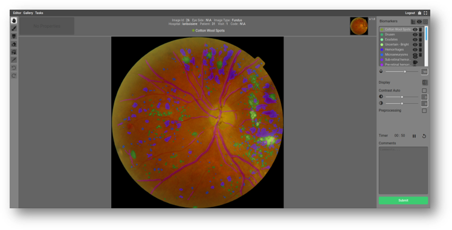

.. AnnotationPlatformDocumentation documentation master file, created by
   sphinx-quickstart on Wed Nov  4 10:45:26 2020.
   You can adapt this file completely to your liking, but it should at least
   contain the root `toctree` directive.

***************************************************************************
Welcome to the Retinal Annotation Project's!
***************************************************************************

.. toctree::
   :maxdepth: 2
   :caption: Contents:

What's our project?
========================
This project emerges from a collaboration between the Hospital Maisonneuve-Rosemont (**HMR**), Quebec Artificial Intelligence Institute (**Mila**)​, Diabetes Action Canada (**DAC**) and our team at the LIV4D laboratory in Polytechnique Montréal.

* Our goal is to collect a large annotated database of fundus images in order to train machine learning algorithms to predict early stage of diabetic retinopathy. 

* Specifically, we want to investigate deep-learning based solutions to facilitate screening of early DR onset and increase the capacity of telemedicine programs.

* **In practice**, this means overcome the technical challenges preventing state of the art screening models from being successfully applied in this context.

* To facilitate the communication between retinal specialists and our computer vision team, we have launched an online platform developed to collect and annotate retinal images.

   
Core features of the software are:

* Web-based application​
* Retinal images anonymized and stored securely on an institutional server​
* Labelling of biomarkers & disease grading.

    
How to?
========================

* **Getting started** 
    Not familiar with the platform yet? Check out this tutorial:
    :doc:`Quick start </intro/getting_started>`

* **Looking for a shortcut?**
    :doc:`Lists of shortcuts </guides/shortcuts>`

* **Documentation**
    Looking for more details about a functionality?
    :doc:`Follow the guide </guides/guide>` or check out the links below:
    
.. toctree::
      :maxdepth: 2
    
      /intro/getting_started
      /guides/guide
      /guides/shortcuts
      /us
   

        
Want to know more about our team?
---------------------------------
    :doc:`LIV4D</us>`   

